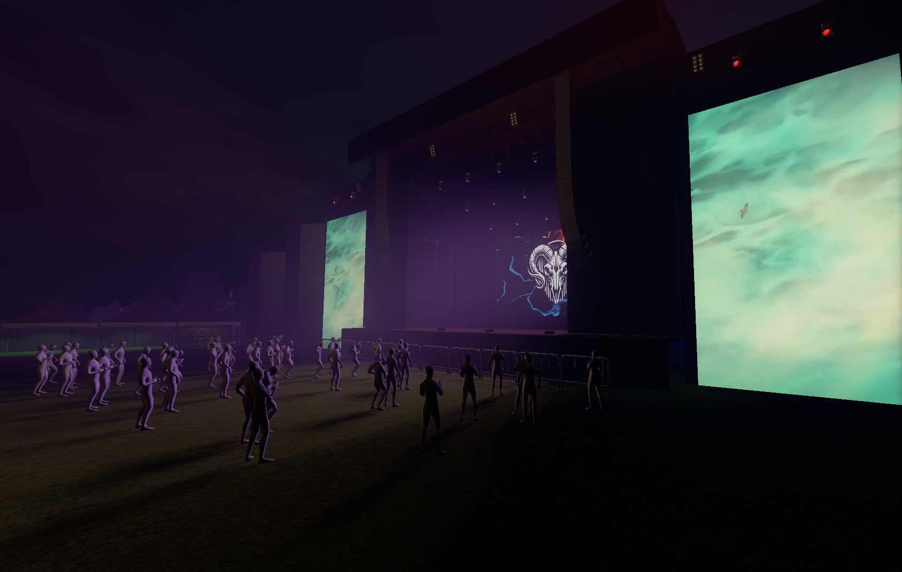
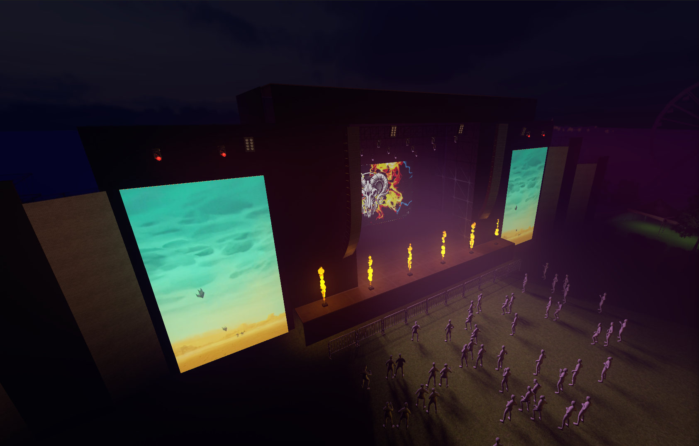
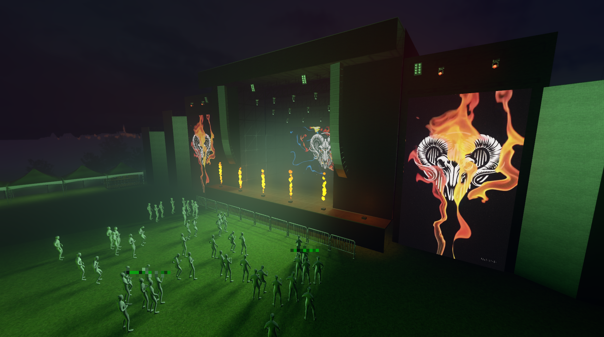

# MusicFFTServer

## Description

Simple audio analyzer that streams FFT data over UDP from system sound.

This small utility plays a key role in a larger personal project:  
a real-time, dynamic 3D stage streamed on Twitch.

The full stage system is not open-source — it's a more ambitious and original project I prefer to keep private.  
Still, here are a few screenshots to show how this basic tool fits into something more visual:

## Platform

- Windows

## Dependencies

- NAudio